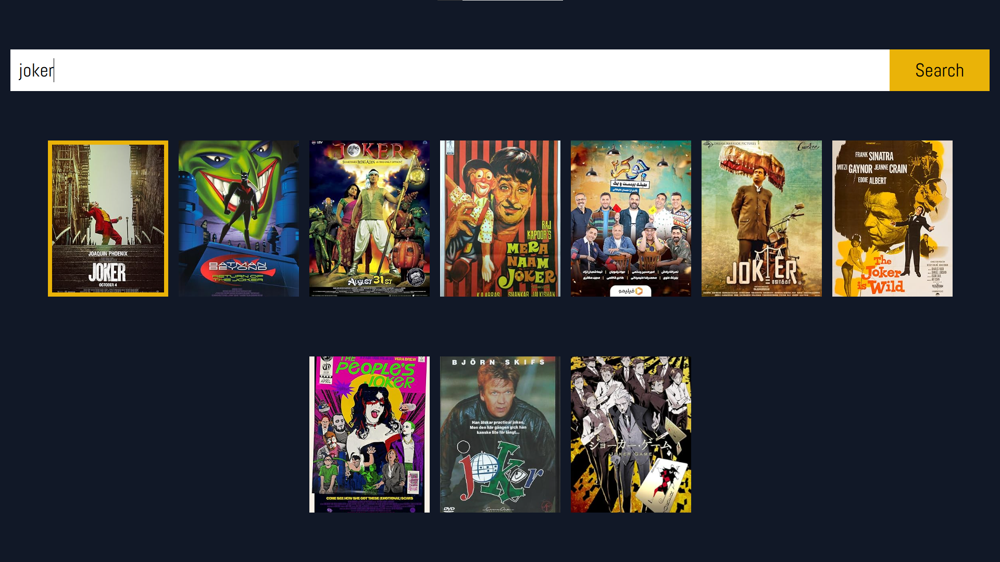
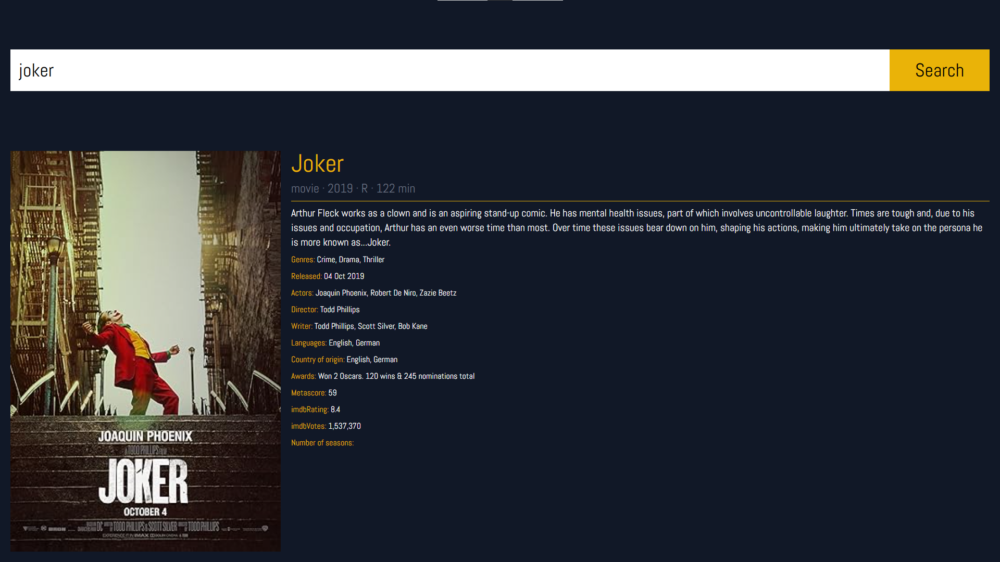

# MovieSearch

React app that allows you to search for movies.

Uses OMDb API.

Make sure to fill in your OMDb API in the index.js file for the app to work.

Upen using the search bar movies are going to be displayed.

To see the details of the movie click on the movie poster.

This project was created as homework for my teacher. 

